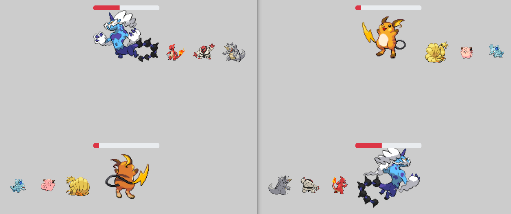

# PokeFighter

## Overview

PokeFighter is a project I developed for the students I had at the IPSSI school, which is why the source code is not provided. The goal is to develop a web application with a user interface and server-side management using the MERN stack (MongoDB, ExpressJS, ReactJS, NodeJS). The project utilizes the [PokeAPI](https://pokeapi.co/) to retrieve information about Pokémon.

You can access the website [here](https://pokefighter-136fb.web.app/).

  

## Features

* Display of all Pokémon with a search bar functionality.
* Users start with four pokecoins.
* Each pokecoin can be used to obtain a new random Pokémon.
* Users can battle other users with their four Pokémon.
* The winner of the battle receives a pokecoin.

## Technologies Used

* MongoDB: NoSQL database for storing user data.
* ExpressJS: Framework for creating and managing server-side API.
* ReactJS: Framework for building a dynamic and responsive user interface.
* NodeJS: Server-side JavaScript runtime environment.

## Challenges and Learnings

* Understanding the MERN stack and its application for developing a full-featured web application, suitable for teaching students.
* Integrating the PokeAPI to obtain information about Pokémon and effectively managing API calls.
* Designing and implementing battles between users, along with the associated game mechanics.
* Deploying the application on a hosting platform.

## Screenshots

  
  
  

## Troubleshooting

The website may be slow upon the first connection. Don't hesitate to refresh the page if it takes too long, or try again in a few minutes.
